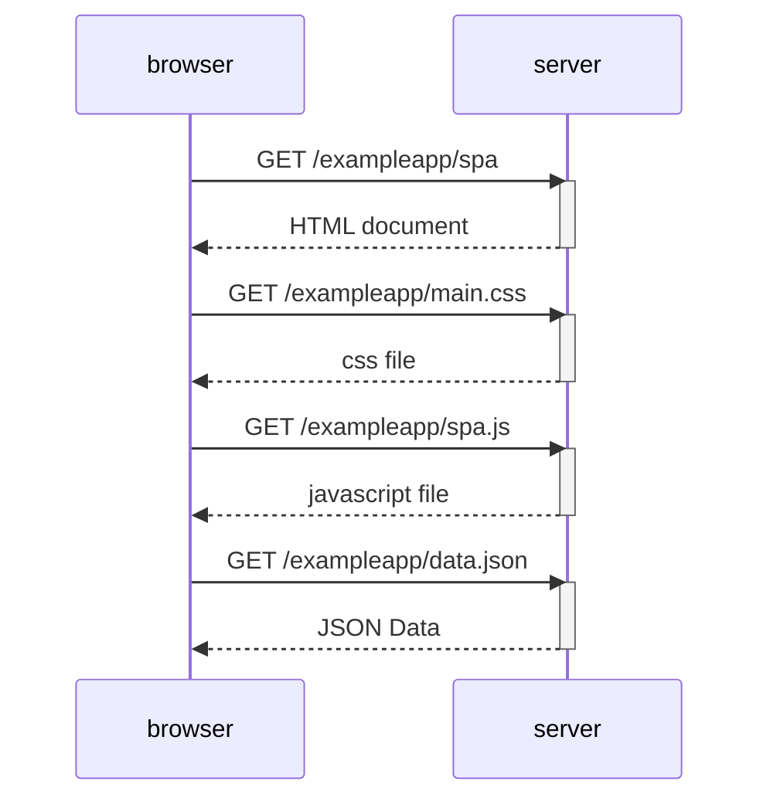

```mermaid
sequenceDiagram
    participant browser
    participant server
    
    browser->>server: GET /exampleapp/spa
    activate server
    server-->>browser: HTML document
    deactivate server

    browser->>server: GET /exampleapp/main.css
    activate server
    server-->>browser: css file
    deactivate server
    
    browser->>server: GET /exampleapp/spa.js
    activate server
    server-->>browser: javascript file
    deactivate server
    
    browser->>server: GET /exampleapp/data.json
    activate server
    server-->>browser: JSON Data
    deactivate server
       
```
